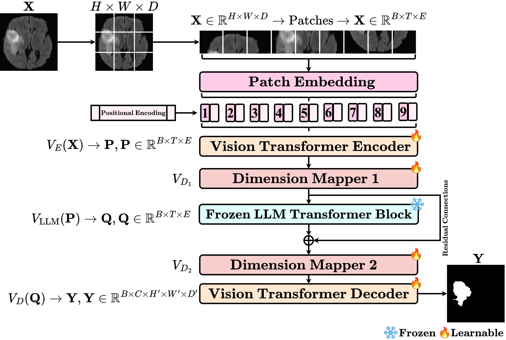
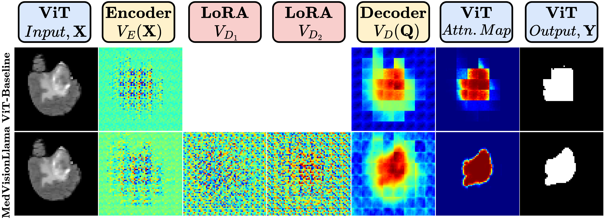
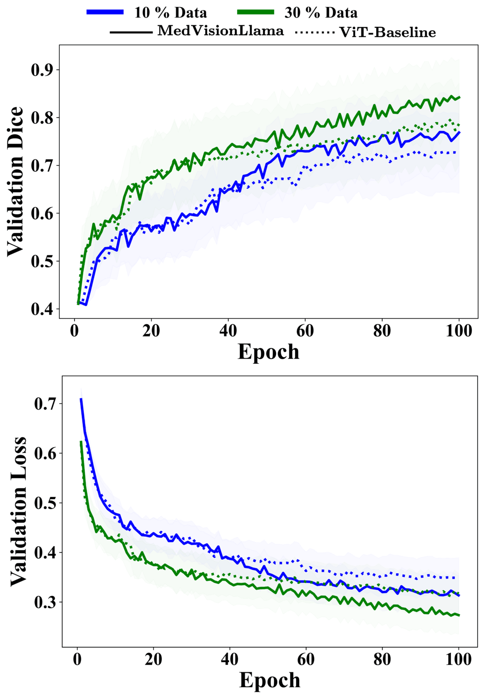
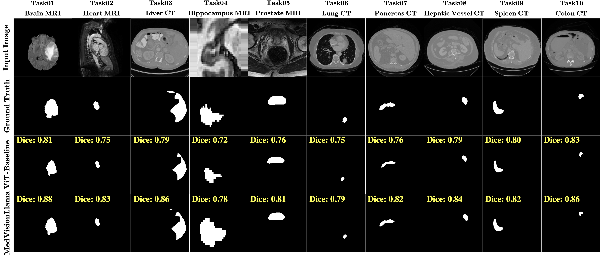

# MedVisionLlama: Leveraging Pre-Trained Large Language Model Layers to Enhance Medical Image Segmentation

This repository contains the official implementation of **["MedVisionLlama: Leveraging Pre-Trained Large Language Model Layers to Enhance Medical Image Segmentation"](https://arxiv.org/abs/2410.02458)** by Gurucharan Marthi Krishna Kumar, Aman Chadha, Janine Mendola, and Amir Shmuel.

**[10.07.2025]**: ⭐ Our paper was accepted to the CVAMD Workshop (Computer Vision for Automated Medical Diagnosis) at the 2025 IEEE/CVF International Conference on Computer Vision (ICCVW 2025).

[](https://arxiv.org/abs/2410.02458)
[](LICENSE)
[](https://www.python.org/downloads/release/python-380/)
[](https://pytorch.org/)

## 🎯 Overview

MedVisionLlama introduces a novel approach that integrates pre-trained Large Language Models (LLMs) with Vision Transformers (ViTs) for enhanced medical image segmentation. By leveraging frozen LLM weights as residual attention boosters, our method significantly improves segmentation performance, particularly in data-constrained clinical environments.

### Key Features
- **🧠 LLM-Enhanced ViT Architecture**: Integrates frozen pre-trained Llama weights into ViT-based segmentation models
- **⚡ Parameter-Efficient Fine-Tuning**: Uses Low-Rank Adaptation (LoRA) for efficient model adaptation
- **📊 Comprehensive Evaluation**: Tested on 10 diverse medical imaging datasets from the Medical Segmentation Decathlon
- **🔍 Superior Performance**: Consistently outperforms standard ViT baselines across all evaluation metrics
- **💡 Data Efficiency**: Maintains strong performance even with limited training data (10% and 30% scenarios)

## 🏗️ Architecture

### Overall Framework


The architecture integrates a frozen pre-trained LLM transformer block into a Vision Transformer, enhancing feature representation for 3D medical image segmentation through residual connections. The framework shows the complete pipeline from input processing through patch embedding, ViT encoding, LLM enhancement, and final segmentation output.

### Detailed Architecture Flow

The detailed architecture demonstrates how 3D medical images are processed through:
1. **Patch Extraction**: 3D volumes are divided into patches and embedded
2. **Vision Transformer Encoder**: Extracts visual features with positional encoding
3. **Dimension Mappers**: LoRA-based adapters bridge ViT and LLM feature spaces
4. **Frozen LLM Block**: Llama transformer provides semantic enhancement via residual connections
5. **Vision Transformer Decoder**: Generates final segmentation masks


## 🤖 Models  
This repository contains several models under the `models/` directory. Each model can be used for medical image segmentation with LLM enhancement. Below are the available models:

### Available Model Variants
- **[MedVisionLlama](src/models/medvision_llama.py)**: Main model with Llama-3.1-8B integration
- **[MedVision_BioBERT](src/models/medvision_biobert.py)**: BioBERT-enhanced ViT for medical segmentation  
- **[MedVision_BioGPT](src/models/medvision_biogpt.py)**: BioGPT-enhanced ViT for biomedical applications
- **[MedVision_ClinicalBERT](src/models/medvision_clinicalbert.py)**: ClinicalBERT-enhanced ViT for clinical data
- **[ViT_Baseline](src/models/vit_baseline.py)**: Standard ViT without LLM enhancement (baseline)
- **[ViT_Depth](src/models/vit_depth.py)**: Enhanced ViT with increased depth and attention heads
- **[ViT_MLP](src/models/vit_mlp.py)**: Enhanced ViT with larger MLP layers

## 📁 Data Directory Structure  
The `Data_Folder/` directory is structured as follows to organize training and testing datasets for medical image segmentation:

```
Data_Folder/
├── Task01_BrainTumour/
│   ├── imagesTr/                    # Training images (.nii.gz)
│   ├── labelsTr/                    # Training labels (.nii.gz)
│   ├── imagesTs/                    # Test images (.nii.gz) [optional]
│   ├── labelsTs/                    # Test labels (.nii.gz) [optional]
│   └── data_file.txt                # Image-label pairs mapping
├── Task02_Heart/
│   ├── imagesTr/
│   ├── labelsTr/
│   └── data_file.txt
├── Task03_Liver/
│   ├── imagesTr/
│   ├── labelsTr/
│   └── data_file.txt
└── [Task04-Task10]/                 # Additional MSD tasks
    ├── imagesTr/
    ├── labelsTr/
    └── data_file.txt
```

### Data File Format
Each `data_file.txt` contains comma-separated image-label pairs:
```
imagesTr/image_001.nii.gz,labelsTr/label_001.nii.gz
imagesTr/image_002.nii.gz,labelsTr/label_002.nii.gz
imagesTr/image_003.nii.gz,labelsTr/label_003.nii.gz
...
```

## 🛠️ Installation

### Prerequisites
- Python 3.8+
- CUDA-enabled GPU (optional but recommended)
- Dependencies: PyTorch, Transformers, PEFT, NumPy, SciPy, Matplotlib

### Setup
1. Clone the repository:
   ```bash
   git clone https://github.com/yourusername/MedVisionLlama.git
   cd MedVisionLlama
   ```

2. Create and activate conda environment:
   ```bash
   conda create -n medvisionllama python=3.8
   conda activate medvisionllama
   ```

3. Install dependencies:
   ```bash
   pip install -r requirements.txt
   ```

## 🚀 Training

### Basic Training Command
```bash
python main.py \
    --data_dir /path/to/data \
    --data_file /path/to/data_file.txt \
    --task_name Task01_BrainTumour \
    --epochs 100 \
    --batch_size 4 \
    --image_size 128,128,128 \
    --patch_size 8,8,8 \
    --lr 2e-3 \
    --dataset_fraction full \
    --model_label MedVisionLlama
```

### Training Parameters
- `--data_dir`: Path to dataset directory
- `--data_file`: Path to data mapping file
- `--task_name`: Task identifier (e.g., Task01_BrainTumour)
- `--epochs`: Number of training epochs (default: 100)
- `--batch_size`: Batch size (default: 4)
- `--image_size`: 3D image dimensions (default: 128,128,128)
- `--patch_size`: 3D patch size (default: 8,8,8)
- `--lr`: Learning rate (default: 2e-3)
- `--dataset_fraction`: Fraction of data to use (full, 0.1, 0.3)
- `--model_label`: Model variant to use

## 🔄 Model Variations

### 1. Data Fraction Experiments

#### 10% Data Training
```bash
python main.py --dataset_fraction 0.1 --model_label MedVisionLlama [other_params]
```

#### 30% Data Training
```bash
python main.py --dataset_fraction 0.3 --model_label MedVisionLlama [other_params]
```

### 2. Medical LLM Variants

#### MedVision_BioBERT
```bash
python main.py --model_label MedVision_BioBERT [other_params]
```

#### MedVision_BioGPT
```bash
python main.py --model_label MedVision_BioGPT [other_params]
```

#### MedVision_ClinicalBERT
```bash
python main.py --model_label MedVision_ClinicalBERT [other_params]
```

### 3. ViT Architecture Variants

#### ViT with Increased Depth
```bash
python main.py --model_label ViT_Depth [other_params]
```

#### ViT with Enhanced MLP
```bash
python main.py --model_label ViT_MLP [other_params]
```

## 📊 Results

1. **Activation Map Analysis**: MedVisionLlama shows more focused attention on key anatomical areas, improving feature refinement and stability across layers.  
   

2. **Training Performance Curves**: MedVisionLlama outperforms the baseline with faster convergence and better generalization on limited data.  
    

3. **Qualitative Segmentation Results**: MedVisionLlama achieves higher segmentation accuracy across diverse medical modalities and anatomical structures.  
   


### Quantitative Performance
MedVisionLlama demonstrates consistent improvements across all 10 MSD tasks:

| Metric | ViT-Baseline | MedVisionLlama | Improvement |
|--------|--------------|----------------|-------------|
| **Dice Score** | 0.74 ± 0.05 | 0.87 ± 0.04 | **+17.6%** |
| **NSD** | 0.66 ± 0.05 | 0.77 ± 0.05 | **+16.7%** |
| **HD95** | 14.5 ± 3.8 | 10.3 ± 2.3 | **-29.0%** |

### Key Findings
- ✅ **Consistent Improvements**: Better performance across all 60 metric comparisons
- ✅ **Statistical Significance**: 41/60 comparisons show p < 0.05
- ✅ **Few-Shot Learning**: Superior performance with limited data
- ✅ **Cross-Modal Generalization**: Effective across MRI and CT modalities

### Comparison with State-of-the-Art
| Model | Average Dice | Average NSD |
|-------|--------------|-------------|
| UNet++ | 0.79 ± 0.04 | 0.70 ± 0.05 |
| UNETR | 0.77 ± 0.05 | 0.68 ± 0.06 |
| nnU-Net | 0.81 ± 0.05 | 0.71 ± 0.05 |
| Swin-UNet | 0.85 ± 0.05 | 0.74 ± 0.05 |
| **MedVisionLlama** | **0.87 ± 0.04** | **0.77 ± 0.05** |


## 📚 Citation

If you use this work in your research, please cite:

```bibtex
@article{kumar2024medvisionllama,
  title={MedVisionLlama: Leveraging Pre-Trained Large Language Model Layers to Enhance Medical Image Segmentation},
  author={Kumar, Gurucharan Marthi Krishna and Chadha, Aman and Mendola, Janine and Shmuel, Amir},
  journal={arXiv preprint arXiv:2410.02458},
  year={2024}
}
```

## 📞 Contact

For questions or collaborations:
- **Gurucharan Marthi Krishna Kumar**: [gurucharan.marthikrishnakumar@mail.mcgill.ca](mailto:gurucharan.marthikrishnakumar@mail.mcgill.ca)
- **Project Issues**: [GitHub Issues](https://github.com/gurucharan-marthi/MedVisionLlama-LLMs-for-Medical-Image-Segmentation/issues)

---

<div align="center">
  
**🌟 Star us on GitHub — it helps!**

[⬆ Back to Top](#medvisionllama-leveraging-pre-trained-large-language-model-layers-to-enhance-medical-image-segmentation)

</div>
